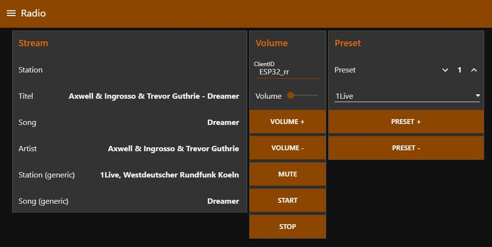

# ESP32-Radio-TTGO
ESP32 Internet Radio with Display 

## Introduction
Existing radios or loudspeakers will be used in order to get decent sound quality.
The display should show relevant information and the font size should not be too small.

Most of the time you just want to switch the device on and listen to the music.
There are only two things you want to change: volume and radio station.
Nevertheless there is only one dial to cover both functions.

In addition there is a webserver including song covers as well as mqtt to allow integration into home automation.

## Operation
### Display
#### Default view

#### Select radio station
Selecting a new radio station is done async. I.e. you can scroll up and down in the list without delay but tuning to the new station will happen after 3 seconds.

 

#### Change Volume
When you turn the rotary encoder, the display is showing the volume.
After 3 secinds the display will revert back to the default screen.

### Webserver

### MQTT

### Node-RED

## Setup
### WiFi Manager
Upon first boot, the wifi  manager will start and ask for wifi credentials as well as mqtt setting.
### Radio Stations
10 stations can be configured using the four parameters below. PlatformIO: data/setup.ini
- RadioName = 1Live
- RadioURL = http://wdr-1live-live.icecast.wdr.de/wdr/1live/live/mp3/128/stream.mp3
- RadioTitleSeperator = -
- RadioTitleFirst = Artist

| Token               | Comment    |
| :----------         | :----- |
| RadioName           | A short name to be shown on the display |
| RadioURL            | url of the mp3 stream |
| RadioTitleSeperator | Some stations are using '/' or '-' to split artist and title |
| RadioTitleFirst     | Indicate if order is Title/Artist or Artist/Title |

## Hardware

Despite of the TTGO you need the audio decoder and a rotary encoder.

### Digital / Analog Converter – DAC
The PCM5102 is using the I2S interface.

| PCM5102     | ESP    |
| :---------- | :----- |
| P_I2S_LRCK  | Pin 25 |
| P_I2S_BCLK  | Pin 26 |
| P_I2S_DATA  | Pin 22 |

In addition you need to connect the following pins:

| PCM5102 | Wiring      | Comment |
| :------ | :---------- |:----- |
| FLT     | GND         | Filter Select. GND for normal latency|
| DEMP    | GND         | De-Emphasis control. Low = off|
| SMT     | GND         | Audio format. Low = I2S|
| XMT     | 10K -> 3V3  | Mute: pulled via 10k Resistor to 3,3V to un-mute|

### Rotary Encoder
The direction can be changed by swapping A + B.

| Encoder     | ESP    |
| :---------- | :----- |
| P_ENC0_A    | Pin 12 |
| P_ENC0_B    | Pin 13 |
| P_ENC0_BTN  | Pin 15 |
| P_ENC0_PWR  | Pin  2 |

## Software 

To install the software you need to create the binary and uplad the content of the data folder.

### MQTT
MQTT is optional. If you do not have an MQTT broker installed you can ignore all settings.
The radio will still work if the MQTT broker cannot be reached.
MQTT is used to provide a generic interface for e.g. home automation.
In addition NodeRED can be used to generate a simple user interface.

### PlatformIO

#### BINARY - Program Code

Create the binary from program code and upload
- Build
- Upload

### DATA - Filesystem

#### LittleFS

The build in upload tool for ESP32 does not work for littleFS. Two files are used to overcome this:
- littlefsbuilder.py
- mklittlefs.exe

##### platformio.ini
- board_build.filesystem = littlefs
- extra_scripts = ./littlefsbuilder.py

#### TFT_eSPI

Either copy the user files files or manual adjust as shown below.
- source: README\TFT_eSPI 
- target: PlatformIO\Projects\TTGO-Radio\.pio\libdeps\esp32doit-devkit-v1\TFT_eSPI

##### User_Setup.h
File: PlatformIO\Projects\TTGO-Radio\.pio\libdeps\esp32doit-devkit-v1\TFT_eSPI\User_Setup.h
  Comment the default with “//” and use ST7789 ,i.e. remove the comment signs “//”

- // #define ILI9341_DRIVER
- #define ST7789_DRIVER      // Full configuration option, define additional parameters below for this display

##### User_Setup_Select.h
File: PlatformIO\Projects\TTGO-Radio\.pio\libdeps\esp32doit-devkit-v1\TFT_eSPI\User_Setup_Select.h

- // #include <User_Setup.h>
- #include <User_Setups/Setup25_TTGO_T_Display.h>    // Setup file for ESP32 and TTGO T-Display ST7789V SPI bus TFT

#### setup.ini
Maintain your favorite radio stations (see above) in data/setup.ini

#### Build Filesystem and Upload Filesystem Image
Open the PlatformIO Menu on the top left and perform both steps: 
- Build Filesystem Image
- Upload Filesystem Image
Note: you may need to unplug/plugin your ESP to upload the image

